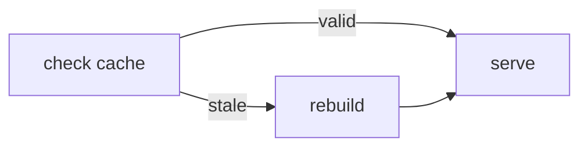

[← 戻る](../../README-ja.md) | [English](README.md) | [Japanese](README-ja.md)

# mermaid

Mermaid 図を描くときのハウスルール。ライト／ダークどちらのテーマでも読みやすく、
かつ図が横に広がりすぎないようにするためのもの。

## ルール

1. **ノードに背景色を使わない。** 塗りつぶすとラベルの文字が読みにくくなり、
   片方のテーマ向けに選んだ色はもう片方で破綻する。グループ分けが必要なら
   `subgraph`・線・ノード形状で表現する。
2. **ひし形ノードを使わない。** `{...}` は大きく、テキストが増えるとどんどん
   横に広がる。判断は普通のノードで書き、分岐条件は**エッジのラベル**に置く。
3. **キャプションは短く。** ノードごとに数語まで。**括弧書きは使わない**
   （長くなりがち）。詳細はエッジラベルや `subgraph` のタイトルに逃がす。

## 例

`{is cache valid?}` のひし形＋背景色ではなく、判断は普通のノードに置き、
2つの結果をエッジラベルで表している。

do / don't の具体例は [SKILL.md](SKILL.md) を参照。
