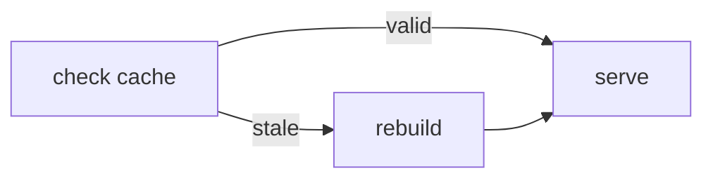

[← Back](../../README.md) | [English](README.md) | [Japanese](README-ja.md)

# mermaid

House rules for drawing Mermaid diagrams, so they stay readable in both light
and dark themes and don't sprawl.

## The rules

1. **No background color on nodes.** Filled nodes make the label text hard to
   read, and a fill picked for one theme fails in the other. Use `subgraph`,
   strokes, or node shape to group things instead.
2. **No diamond nodes.** The `{...}` shape is large and grows wide with text.
   Write the decision as a plain node and put the branch condition on the edge
   label.
3. **Short captions.** A few words per node. **No parentheses** — they inflate
   the caption. Push detail onto edge labels or `subgraph` titles.

## Example

Rather than a `{is cache valid?}` diamond with a filled background, the decision
lives in a plain node and the two outcomes are edge labels.

See [SKILL.md](SKILL.md) for the exact do / don't pairs.
